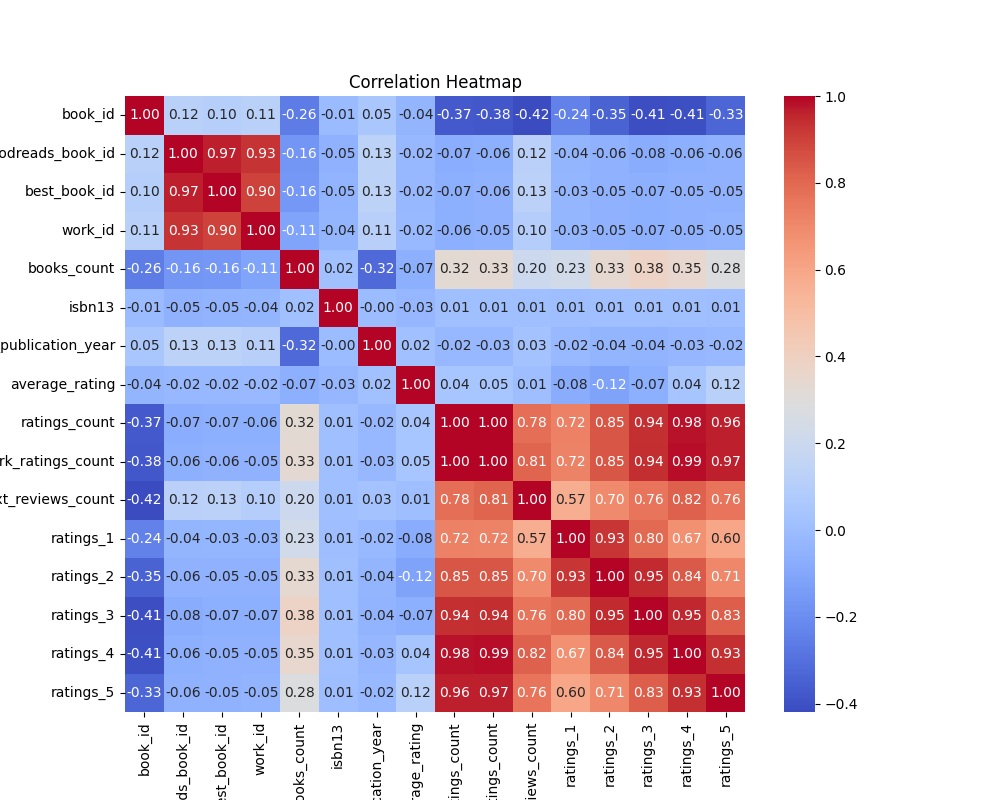
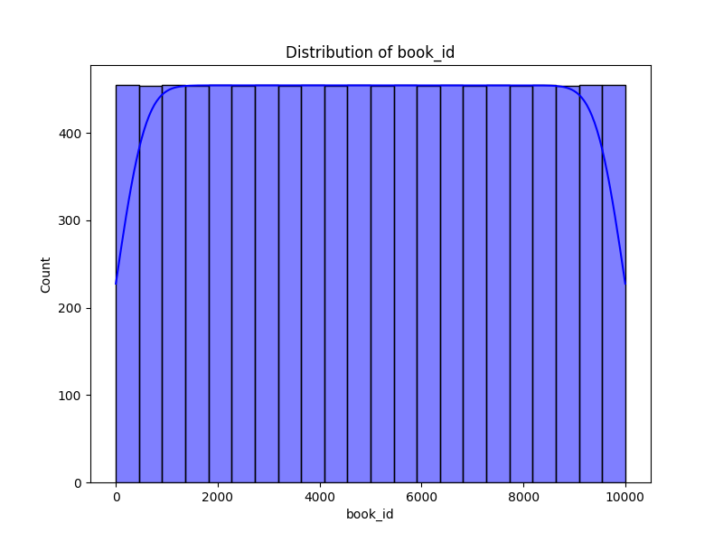
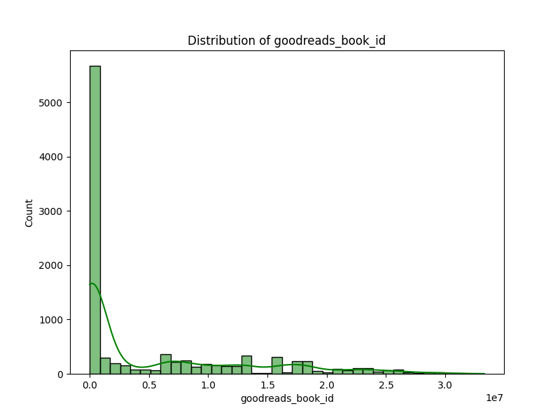

### Narrative Based on Analysis of `goodreads.csv`

#### Overview of the Data

The dataset `goodreads.csv` contains information about 10,000 books, featuring attributes like book IDs, authors, publication years, average ratings, number of ratings, and the number of reviews. A summary of missing values indicates that there are specific columns with several missing entries, which require attention in any subsequent analysis.

#### Key Findings from Summary Statistics

1. **Authors and Titles**: The dataset includes 4,664 unique authors and 9,964 unique titles. Notably, the most frequently appearing author is Stephen King, with 60 occurrences, suggesting a dominance of popular authors in the dataset.

2. **Publication Years**: The average original publication year is approximately 1982, with publication dates ranging from 1750 to 2017. Understanding how these publication years correlate with ratings could reveal insights about trends in literary popularity.

3. **Ratings and Reviews**: 
   - The average rating across books is approximately **4.00**, indicating a generally favorable reception of the books. 
   - A large number of reviews exist, with an average of around **2,919** text reviews per book. However, there are outliers for books with exceptionally high review counts, reaching up to 155,254.
   - The **ratings count** also shows significant variability, with some books receiving over **4.7 million** ratings, emphasizing the extreme popularity of certain titles.

4. **Distribution of Ratings**: The distribution of the ratings has notable outliers:
   - The average number of 1-star ratings is around **1,345**, whereas the average number of 5-star ratings is **23,790**, indicating a tendency toward positive feedback, potentially highlighting confirmation bias in reader reviews.

5. **Missing Data**:
   - There are notable instances of missing values in columns like `isbn` (700 missing) and `isbn13` (585 missing), as well as `original_title` (585 missing). A significant number of entries in `language_code` (1,084 missing) also suggest that the dataset may primarily represent English literature, as indicated by the top value for `language_code`.

#### Correlation Insights

The correlation matrix reveals several interesting trends:

- **Ratings Count Correlation**: There's a strong positive correlation between various rating categories (1 to 5 stars), with the highest correlation existing between `ratings_count` and `work_ratings_count` (**0.995**), indicating that books with more ratings tend to have a higher totality of work ratings.

- **Books Count**: The `books_count` variable is negatively correlated with many attributes including `ratings_count` and `average_rating`, suggesting that more prolific authors (those with many books published) may have lower average ratings or fewer ratings overall, highlighting the variance in reader preferences.

#### Outliers and Anomalies

- Outliers exist in the ratings distribution where a handful of books receive a disproportionately high number of ratings, while others seem to have very few. 
- The distribution of textual reviews and ratings indicate skewness towards popular titles, suggesting the presence of a few highly-rated outliers that could distort overall averages.

#### Suggested Further Analyses

1. **Clustering**: 
   - Perform clustering analysis (e.g., K-means or hierarchical clustering) based on features such as `average_rating`, `ratings_count`, and `work_text_reviews_count` to group similar books together. This may help in identifying which groups of books are receiving similar types of feedback.

2. **Anomaly Detection**:
   - Utilize anomaly detection techniques to identify outlier books that have either abnormally high or low ratings compared to their peers. This could involve employing statistical tests or machine learning algorithms designed to capture outliers.

3. **Time Series Analysis**:
   - Explore trends over time in terms of publication years and ratings. A time series analysis could highlight how the popularity of genres or authors has evolved.

4. **Sentiment Analysis**:
   - Conduct a sentiment analysis of the text reviews to gain further insights into readers' deeper feelings about each book, beyond the star ratings.

#### Implications for Future Decisions

Understanding the trends and patterns gleaned from this dataset can significantly inform decisions in various areas such as:

- **Marketing Strategies**: Publishers can identify popular genres or authors and tailor marketing campaigns accordingly.
- **Publishing Opportunities**: New authors can analyze successful trends by examining high- and low-rated books to adjust their writing styles or genres.
- **Investments in Upcoming Titles**: Analyzing patterns of reviews and ratings may help predict which new releases are likely to succeed based on historical data.
- **Diversity in Literature**: Identifying gaps in the dataset could encourage more inclusive publishing practices to diversify the genres and authorship represented in popular literature.

Overall, the rich dataset at hand offers numerous avenues for further exploration that can lead to actionable insights for stakeholders in the literary community.

