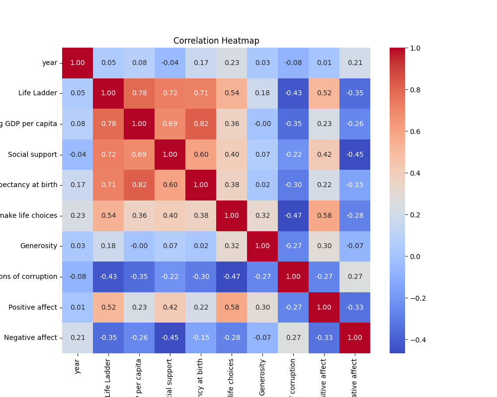
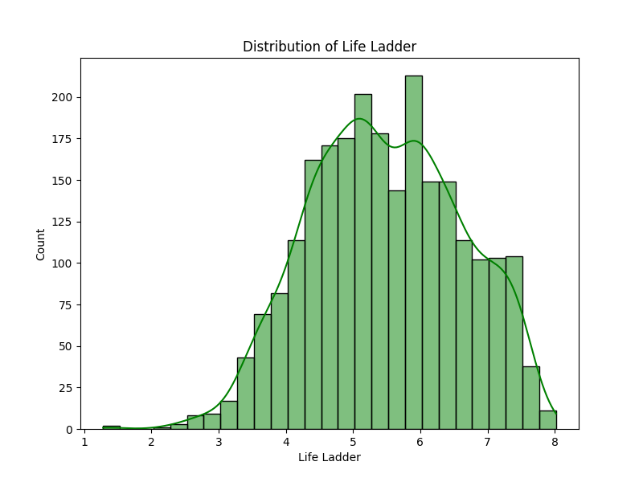
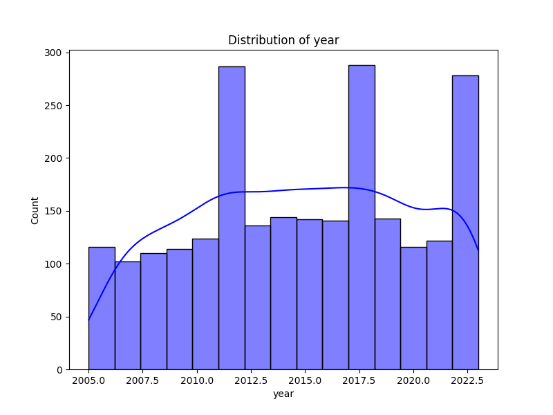

### Detailed Narrative on 'happiness.csv' Analysis

#### Overview

The dataset 'happiness.csv' encompasses various indicators impacting happiness levels across different countries from 2005 to 2023. It includes attributes such as the Life Ladder (a measure of subjective wellbeing), economic metrics like GDP per capita, social support levels, health metrics, freedom to make life choices, and perceptions of generosity and corruption. 

#### Summary Statistics

1. **Country Representation**:
   - The dataset comprises data on 165 unique countries, with Lebanon appearing most frequently (18 records). The diversity in country representation allows for comparative analysis across regions and cultures.

2. **Temporal Coverage**:
   - The data spans from 2005 to 2023, with an overall mean year of approximately 2014.76. This temporal coverage provides insights into how happiness and its determinants have evolved over time.

3. **Life Ladder**:
   - The average score on the Life Ladder is around 5.48, with a standard deviation of 1.13. The minimum score is 1.281, indicating potentially severe happiness challenges in specific countries. The upper limit of 8.019 suggests there are nations expressing high levels of happiness.

4. **Economic Indicators**:
   - The average Log GDP per capita is 9.40, indicative of reasonable economic levels among the surveyed countries. There are 28 missing values here, suggesting either incomplete data or unreported economic statistics in some countries.

5. **Social Support and Health**:
   - Average social support scores are 0.81, with a range that indicates variation in community support systems. Healthy life expectancy averages at 63.40 years, with 63 missing values, indicating some limitations in health data reporting.

6. **Personal Freedom and Generosity**:
   - The average score for freedom to make life choices is approximately 0.75, with relatively high levels of perceived freedom in many countries. Generosity shows a troubling mean of near zero, revealing that while some individuals exhibit generous behaviors, many contribute minimally to social welfare and community support.

7. **Emotional Indicators**:
   - Positive affect averages at about 0.65, while negative affect is at 0.27, indicating higher reported positive emotions relative to negative emotions. This balance is crucial for community wellbeing but highlights the importance of sociocultural factors influencing emotions.

#### Missing Values

The presence of missing values across several columns (most significantly in "Generosity" and "Healthy life expectancy") points to potential gaps in the data collection process. This could skew insights related to these factors, especially as they are influential in understanding comprehensive well-being.

#### Correlation Analysis

Relationships observed within the correlation matrix reveal several essential trends:

1. **Strong Correlations**:
   - **Life Ladder with Log GDP per capita (0.78)**: Strong economic performance correlates significantly with reported happiness.
   - **Life Ladder with Social Support (0.72)**: Greater integration and support among community members also strongly relate to higher happiness.

2. **Negative Correlations**:
   - **Life Ladder with Perceptions of Corruption (-0.43)**: Higher perceptions of corruption are associated with lower happiness levels, suggesting the detrimental effects of mistrust in governmental and social institutions.

3. **Influence of Health**:
   - Significant correlation exists between Life Ladder and Healthy life expectancy (0.71), emphasizing the importance of health as a determinant for happiness.

4. **Freedom and Happiness**:
   - Freedom is positively correlated with happiness (0.54), indicating that personal autonomy plays a critical role in perceived wellbeing.

#### Insights and Trends

- **Outliers**: Countries with an exceptionally high or low Life Ladder score can be considered outliers that warrant detailed case studies.
  
- **Anomalies**: Missing data points, particularly in significant variables like Log GDP and Healthy life expectancy, may hinder a complete understanding of their impact on happiness.

- **Trends**: Countries with lower GDP often correlate with higher perceptions of corruption and lower life ladder scores. Promoting transparency and community support could be pivotal for enhancing happiness in these regions.

#### Recommendations for Further Analysis

1. **Clustering Analysis**:
   - Use clustering techniques (e.g., K-means or hierarchical clustering) to identify groups of countries with similar happiness metrics for targeted policy interventions.

2. **Anomaly Detection**:
   - Implement anomaly detection methods to identify countries that significantly deviate from expected happiness levels given their economic or social metrics. This could inform international organizations aiming for targeted aid.

3. **Time-Series Analysis**:
   - Carry out time-series analyses on how happiness-related metrics have evolved over the years. This could reveal patterns or responses due to significant global events like the COVID-19 pandemic.

4. **Predictive Modeling**:
   - Develop predictive models to forecast future happiness trends based on current metrics, helping policymakers design informed interventions.

5. **Social Impact Assessments**:
   - Examine the cascading effects of increased economic support, health improvements, and reduced corruption on individual happiness levels.

#### Conclusion

The happiness dataset presents an intricate look into how various factors intertwine to affect individual and community well-being across nations. As we advance into potential interventions based on these analytics, understanding and addressing the underlying socio-economic dynamics will be crucial in cultivating a happier global society in the years to come.

