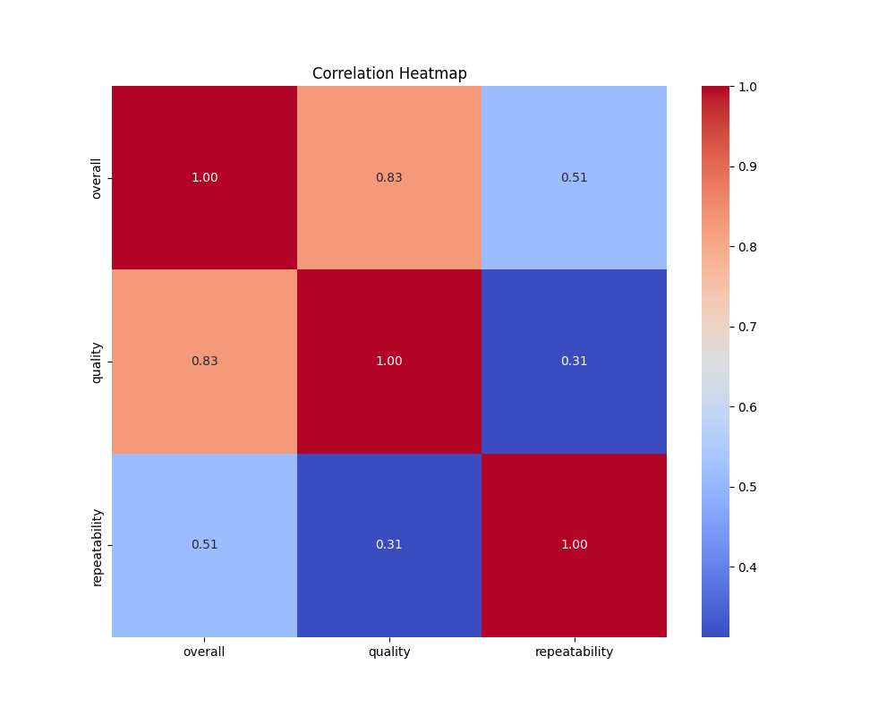
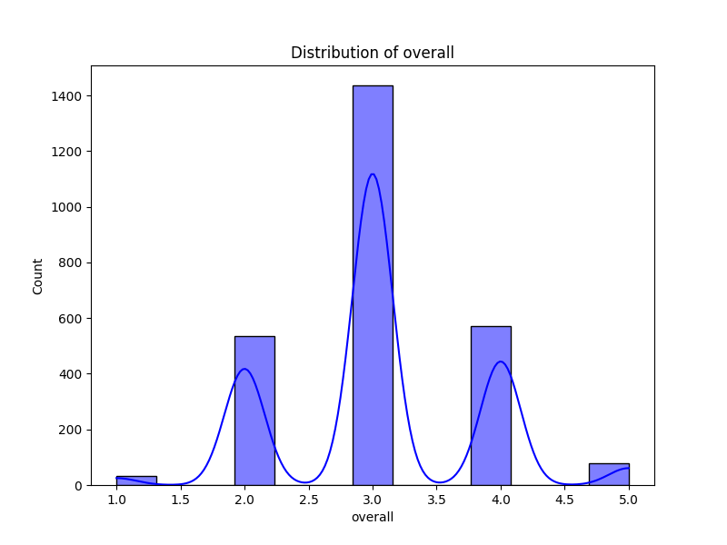
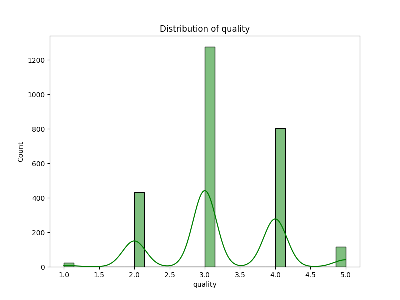

### Narrative on Media Dataset Analysis

**Overview**

The dataset derived from 'media.csv' provides a comprehensive overview of media records, with a total of 2,652 entries spanning various columns related to the metadata of media items. The columns of interest include the date of the entry, the language of the media, its type, title, author (or creator), and three evaluation criteria: overall rating, quality rating, and repeatability. The analysis reveals several insights into the dataset's trends as well as areas that warrant further exploration.

---

**Key Findings**

1. **Date Distribution**:
   - The date column contains 2,553 entries, indicating that 99 records are missing dates. Notably, the most frequent date is '21-May-06', recorded eight times, suggesting a possible data entry anomaly or significant relevance for entries around that period.
   - The dataset's uniqueness (2,055 distinct dates) indicates a rich temporal variation, pointing to the necessity of examining trends over time. However, the presence of missing dates may skew analyses of trends, necessitating imputation.

2. **Language**:
   - English is the most frequent language with 1,306 occurrences (49% of total entries), followed by other languages adding a layer of cultural diversity. This observation could inform targeted marketing strategies or content curation based on audience language preferences. 
   - Further analysis should explore how language may correlate with ratings and viewer preferences.

3. **Media Type**:
   - The predominant media type is 'movie,' given its frequency (2,211 instances). Analyzing viewer reception between movies and other media types (like music or series) could yield insights into audience preferences.
   - Given this skew towards a single type, assessing the influence of media type on ratings (overall, quality, repeatability) will be essential.

4. **Title Popularity**:
   - The title 'Kanda Naal Mudhal' stands out as the most frequently listed title, appearing nine times. A detailed examination of its content and reception could elucidate why it resonates well with audiences compared to other titles.
  
5. **Content Creators**:
   - The most frequent creator, Kiefer Sutherland, appears 48 times, indicating a bias towards specific contributors. Investigating whether particular creators consistently yield higher ratings could inform future talent acquisition.

6. **Ratings Overview**:
   - The average overall rating is approximately 3.05, with quality rated slightly higher at 3.21, while repeatability stands lower at 1.49. The narrow range of ratings, with a maximum of 5, implies that most content tends to receive mediocre to good scores.
   - The clear distinction in ratings suggests a potential gap where viewers perceive quality but may hesitate to engage with content repeatedly, indicating an area for qualitative research refining content strategies.

7. **Correlation Insights**:
   - A high correlation exists between overall ratings and quality ratings (0.826), suggesting that higher perceived quality strongly aligns with overall viewer satisfaction. Conversely, the correlation between repeatability and the ratings is significantly lower, indicating a disconnect between viewer preference and willingness to rewatch content.
   - This can lead to decisions on whether to promote certain content based on its quality rather than on its repeatability.

---

**Further Analyses Suggested**

1. **Time Series Analysis**:
   - Investigate trends over time in overall ratings, language usage, and media types. This could provide insights into shifting viewer preferences or significant events impacting media consumption.

2. **Cluster Analysis**:
   - Applying clustering methodologies can help segment the dataset into meaningful groups based on languages, types, or ratings, allowing for tailored marketing strategies or content creation.

3. **Anomaly Detection**:
   - Automated anomaly detection techniques could identify outlier entries in ratings or frequency, which may reflect either user errors (e.g., incorrect ratings) or genuine phenomenons (unexpected audience reception).

4. **Sentiment Analysis**:
   - If textual reviews or feedback accompany these entries, sentiment analysis can provide further insights into quality perceptions beyond numeric ratings. This would enhance understanding of the qualitative factors influencing viewer choices.

5. **Predictive Modeling**:
   - Developing models to predict overall ratings based on quality or media type could guide content creators in producing more engaging offerings.

---

**Conclusion**

The analysis of the 'media.csv' file reveals significant patterns and relationships that can influence strategic decisions moving forward. By investigating these trends further, practitioners in the media and entertainment industry can optimize content, cater to audience preferences, and enhance overall user satisfaction. Ultimately, understanding these dynamics will be crucial for forging data-driven strategies that align with evolving consumer demands.

